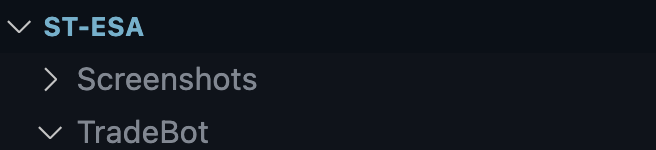
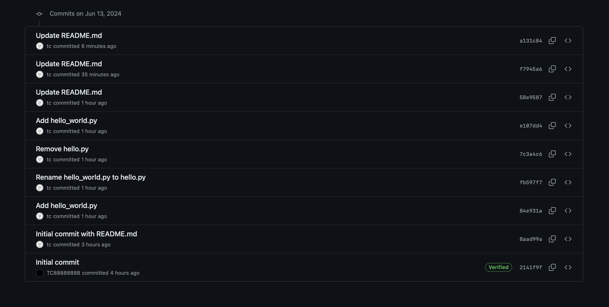
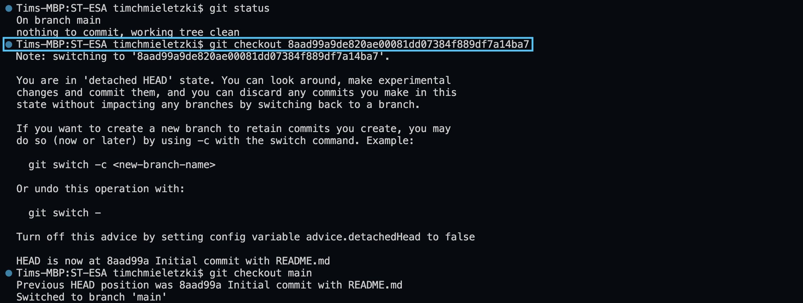
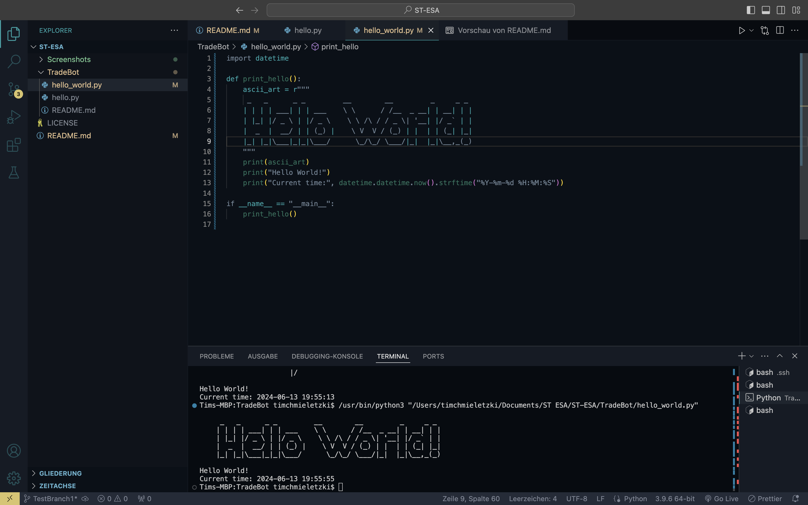
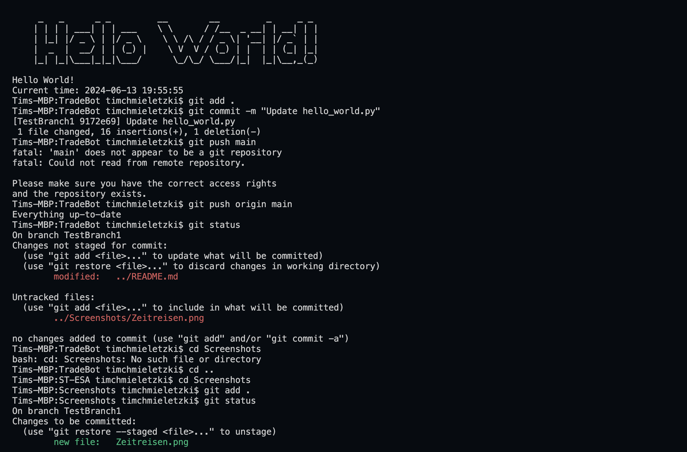
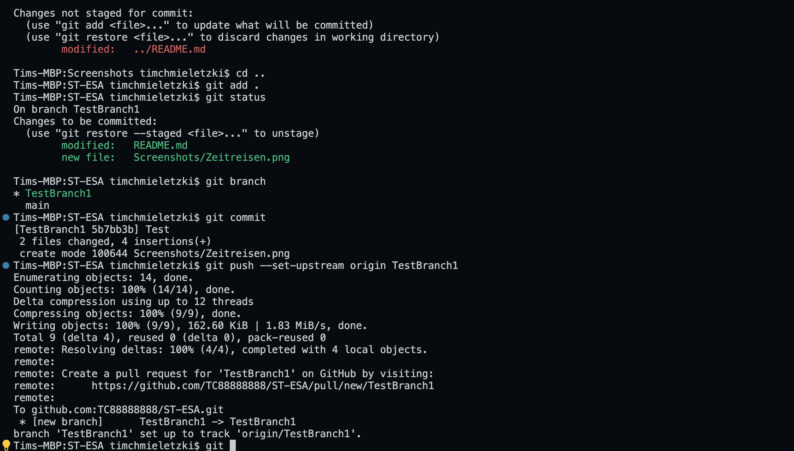
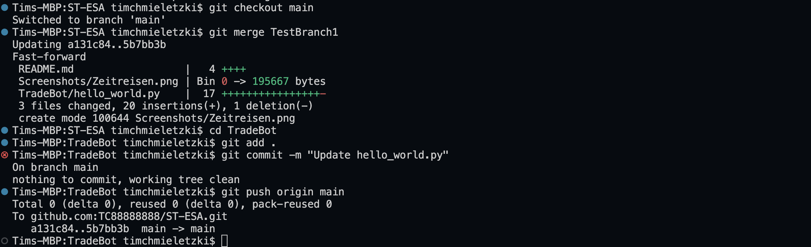

# ST-ESA: DVC

# Tim Chmieletzki

## 1. Erstellung eines Repositorys in GitHub

### Das öffentliches Repository "ST-ESA" wurde erfolgreich in GitHub erstellt.

## 2. Erstellung eines neuen Projekts

### Ich habe im Ordner "ST-ESA" zwei neue Unterordner "Screenshots" und "TradeBot" erstellt. In diesem Ordner ich eine README.md zum Projekt erstellt.

## 3. Ausführen der Methoden commit, pull, push, add, status, diff, mv, rm

### commit, pull, push, add, status

### diff

### mv

### rm

## 4. Experimentieren mit Zeitreisen

### Für das Zeitreisen habe ich mit git checkout und commit hashes gearbeitet, um das Projekt auf einen früheren Stand zu bringen.

## 5. Erstellung von zwei Branches + Merge

### Ich habe eine "TestBranch1" erstellt und in dieser die hello_world.py ausgebessert. Danach habe ich die main branch mit TestBranch1 gemerged.

## 6. Erstellung eines Pull-Requests in GitHub

### Der Pull-Request wurde erstellt und kann [hier](https://github.com/edlich/education/pull/504) eingesehen werden.

### PR Nummer: #504
