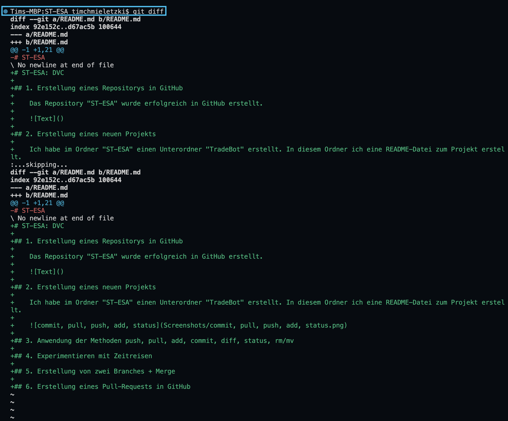

# ST-ESA: DVC

## 1. Erstellung eines Repositorys in GitHub

    Das Repository "ST-ESA" wurde erfolgreich in GitHub erstellt.

    

## 2. Erstellung eines neuen Projekts

    Ich habe im Ordner "ST-ESA" einen Unterordner "TradeBot" erstellt. In diesem Ordner ich eine README-Datei zum Projekt erstellt.

## 3. Ausführen der Methoden commit, pull, push, add, status, diff, mv, rm

    

    

    

    

## 4. Experimentieren mit Zeitreisen

## 5. Erstellung von zwei Branches + Merge

## 6. Erstellung eines Pull-Requests in GitHub
